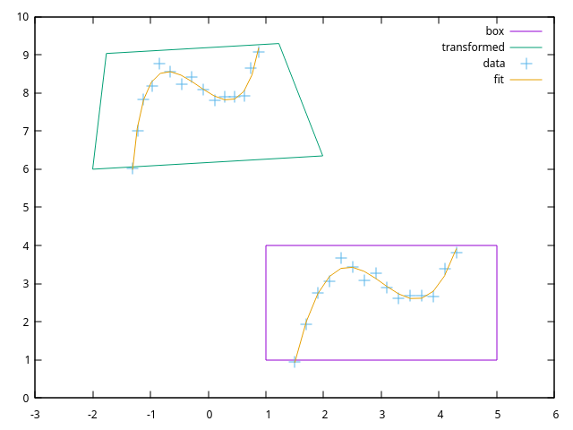

# linear - some linear algebra numerical mothods

## Overview

This [package](http://zappem.net/pub/math/linear/) provides routines
for linear algebra processing activities.

## API

The API provided is available using `go doc zappem.net/pub/math/linear`.
It can also be browsed on the [go.dev](http://go.dev) website:
[package
zappem.net/pub/math/linear](https://pkg.go.dev/zappem.net/pub/math/linear).

## Example

The `examples/show.go` program demonstrates both of the linear methods
to generate a plot. You can render it (assuming you have gnuplot
installed) as follows:

```
$ git clone https://github.com/tinkerator/linear
$ cd linear
$ go run examples/show.go | gnuplot -p
```

Which shows some data in a horizontal box, with a `linear.FitPoly()`
cubic fit for the data it contains. The plot also includes a
`(linear.Affine).Apply()` transformation of the same data, fit and
box--a transform that rotates and distorts the box and its
contents. The data is randomly adjusted, but the above command
generates something that looks like this:



## TODO

## License info

The `linear` package is distributed with the same BSD 3-clause
license as that used by [golang](https://golang.org/LICENSE) itself.

## Reporting bugs

Use the [github `linear` bug
tracker](https://github.com/tinkerator/linear/issues).
